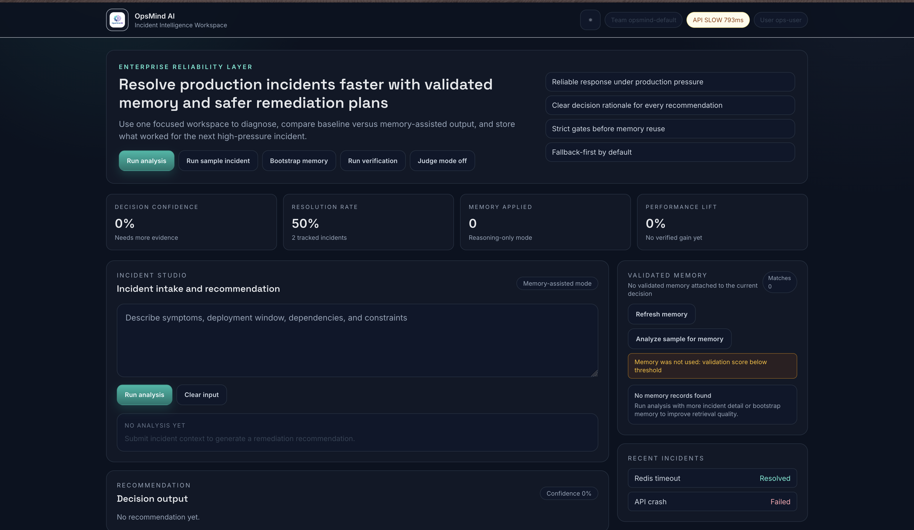

# OpsMind AI — Intelligent Incident Decision System
#Note this tools is in improvement so it may be more advance so it reflects this readMe file may different and advance from these features.
## 🚀 Overview

OpsMind AI is a memory-driven incident intelligence system that learns from past incidents and improves future decisions using Hindsight.

Unlike traditional AI systems, OpsMind AI:

* Uses memory only when relevant
* Rejects irrelevant past incidents
* Improves decision quality over time

---

## 🧠 Key Innovation

We implemented **Hindsight Memory** to:

* Store past incident patterns
* Retrieve relevant memories
* Improve AI-generated solutions
* Reject memory when not applicable

---

## ⚙️ Features

* Incident Analysis Engine
* Memory Retrieval & Filtering
* Before vs After Comparison
* Confidence Scoring
* Continuous Learning System

---

## 🧪 Example Workflow

1. User submits incident
2. AI generates base analysis
3. Hindsight retrieves past memory
4. System evaluates relevance
5. Final improved decision is generated

---

## 🧰 Tech Stack

* Frontend: Next.js, Tailwind
* Backend: Node.js, Express
* AI: Groq / OpenAI-compatible models
* Memory: Hindsight Cloud
* Deployment: Vercel

---

## 🌐 Live Demo

[https://frontend-eta-three-94.vercel.app](https://frontend-eta-three-94.vercel.app)

---

## 📸 Product Screenshot

---

## 🎥 Demo Video

https://drive.google.com/file/d/1lCjSAODiDnDYDS0UXmUzX12I_Hlb90bE/view?usp=sharing

---

## 🧠 Hindsight Memory Usage

* Stores past incidents
* Retrieves relevant patterns
* Improves fix recommendations
* Rejects irrelevant memory (key innovation)

---

## 📌 Problem Solved

Reduces repeated incidents and improves decision-making in production systems.

---

## 🏆 Hackathon Submission

This project demonstrates:

* Real-world AI application
* Memory-driven intelligence
* Production-grade UI/UX
